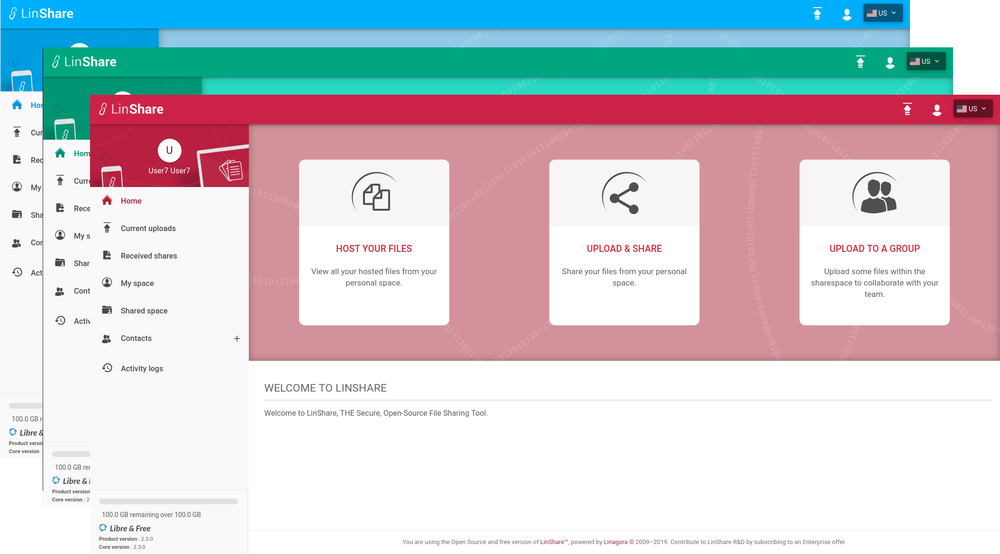

# Exploitation and Administration

## Services, Components and Logs

The LinShare application consists in several components; each component is matching a service. Being able to manage those services and analysing the logs helps to quickly troubleshoot issues.

This table gives an overview of all the services that are used by the LinShare application.

>Note :<br/>
When there are differences between Debian and CentOS, those differences will be depicted by `/`.

| Component | Service | Configuration file | Log file |
| --------------- |:-------------|------------|:---------------:|
| Servlets Container | tomcat8 (Debian) | /var/lib/tomcat8/conf/catalina.properties | /var/log/tomcat8/catalina.out |
| | tomcat (CentOS) | /etc/httpd/conf.d/ | /var/log/tomcat/catalina.out |
| Web Server | apache2 (Debian) | /etc/apache2/sites-available/ | /var/log/apache2/linshare* |
| | httpd (CentOS) | /usr/share/tomcat/conf/catalina.properties | /var/log/httpd/linshare* |
| PostgreSQL | postgresql | /var/lib/pgsql/data/pg_hba.conf | /var/lib/pgsql/data/pg_log/ |
| MongoDB | mongod | /etc/mongod.conf | /var/log/mongodb/mongod.log |
| Thumbnail engine | linshare-thumbnail-server | /etc/linshare/linshare-thumbnail-server.yml | /var/log/thumbnail-server.log |

## Configure the session live time

This configuration can be changed in the following file:
- Debian : `/usr/local/tomcat/conf/web.xml`
- CentOS : `/etc/tomcat/web.xml`

Replace by the desired value (time is in minutes!)
```xml
    <session-config>
        <session-timeout>1</session-timeout>
    </session-config>
```

Save the file and restart tomcat:
On Debian:
```bash
service tomcat8 reload
```
On CentOS:
```bash
systemctl reload tomcat
```

## Change the linshare-ui-user theme

LinShare contains a list of preformatted themes :
* default : a blue theme
* darkgreen
* red



> Note:<br />
It is possible to create your own theme. Please see [creating_a_theme_for_linshare](../development/linshare-ui-user/creating_a_theme_for_linshare.md) for more details.

To switch the theme, edit the value of the third `stylesheet` reference in the file `linshare-ui-user/index.html`:
```xml
<head>
<meta charset="utf-8">
<title>LinShare</title>
<meta http-equiv="X-UA-Compatible" content="IE=edge">
<meta name="viewport" content="width=device-width,initial-scale=1,maximum-scale=1,user-scalable=0">
<meta name="description" content="">
<!-- Place favicon.ico and apple-touch-icon.png in the root directory -->
<link rel="stylesheet" href="styles/vendor.69341249.css">
<link rel="stylesheet" href="styles/materialAdmin.181f57c9.css">
<link rel="stylesheet" href="styles/theme.default.3fbb68fe.css">
</head>
```

Replace by:
- ./styles/theme.default.3fbb68fe.css (default theme),
- ./styles/theme.darkgreen.3fbb68fe.css (darkgreen theme),
- ./styles/theme.red.3fbb68fe.css (red theme),
- or any other installed file theme.

> Note:<br>
For Docker images, there is an environment variable to set for overriding the theme: `LINSHARE_THEME`. This variable can take one of those values: `default`, `darkgreen`, `red`, or any other installed theme name.

### Advanced theming
In the config/config.js file, you also have the possibility to override some images:
```js
// To override the application logo set the url of the image corresponding to the sizes (small 155x29 and big 500x192)
applicationLogo : {
      small : 'images/common/linshare-logo-white.png',
      large : 'images/ls-logo-big.png'
},

// To override the background image of the login screen set the url of the image
loginBackground : 'images/bg-linshare-desktop.png',

```

## Queries and Statistics

> Warning:<br>
This section has been tested for LinShare version 2.3.0. Some SQL queries may have to be adapted for new versions of LinShare.

From a Linux `root` shell, perform the following commands, in order to access the SQL interpreter:
```bash
[root@linshare-linagora /]# su - postgres
Last login: Wed Sep 18 16:11:27 CEST 2019 on pts/0
-bash-4.2$ psql -d linshare
psql (9.2.24)
Type "help" for help.

linshare=#
```

At the end of the operation, you can return to the previous Linux `root` shell by performing the following commands:
```bash
linshare=# \q
-bash-4.2$ exit
logout
[root@linshare-linagora /]# 
```

### Plateform statistics

#### Number of documents

```sql
select count(*) from document;
```

#### Size sum of all documents

```sql
select sum(ls_size) from document;
```
>Warning:<br/>
This sum represents the virtual size used by those documents. Indeed, the component in charge of the document storage is making a data deduplication of those files.

#### The top 10 biggest files

```sql
select * from document order by ls_size desc limit 10;
```

#### Number of users having at least shared a document

```sql
select count(distinct mail) from users as u join log_entry as l on u.mail = l.actor_mail where log_action = 'FILE_SHARE_WITH_ALERT_FOR_USD' or log_action = 'FILE_SHARE' ;
```

### User statistics

The string <EMAIL> stands for the email address of the target user.

#### Number of documents

```sql
select count(*) from entry as e join document_entry as d on e.id = d.entry_id join users as u on u.account_id = e.owner_id where mail = '<EMAIL>';
```

#### Size sum of all documents

```sql
select sum(ls_size) from entry as e join document_entry as d on e.id = d.entry_id join users as u on u.account_id = e.owner_id where mail='<EMAIL>';
```
>Warning:<br/>
This sum represents the virtual size used by those documents. Indeed, the component in charge of the document storage is making a data deduplication of those files.

#### Number of shared documents

```sql
select count(*) from entry as e join document_entry as d on e.id = d.entry_id  join users as u on u.account_id =  e.owner_id where shared >= 1 and mail = '<EMAIL>';
```
